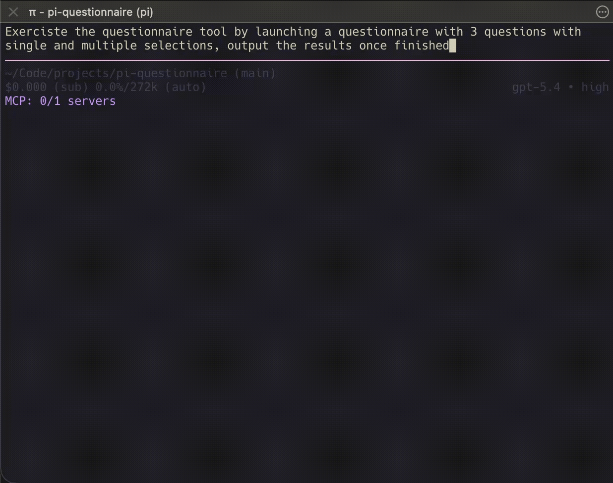

# pi-questionnaire

Interactive `questionnaire` tool for Pi.

It lets an agent pause, ask the user a small structured questionnaire, and continue with machine-readable answers.



## What it provides

- Pi tool: `questionnaire`
- works in standard and RPC Pi sessions when interactive UI is available
- 1 to 5 questions per questionnaire
- 2 to 5 options per question
- single-select or multi-select questions
- optional custom answers
- structured submitted results
- explicit cancellation handling
- fail-fast behavior when interactive UI is unavailable

## Current limits

- interactive UI is required
- one active questionnaire per session
- no resumable questionnaires
- no detached or distributed questionnaire flow outside the active session UI

## RPC session

Questionnaires in subagent flows via RPC are supported. The main caveat is that the UX is a bit less polished because Pi exposes fewer UI primitives over RPC than in a standard session.


## Install

### From npm

```bash
pi install npm:@jd-erreape/pi-questionnaire -l
```

### From git

```bash
pi install git:github.com/jd-erreape/pi-questionnaire -l
```

### From a local path

```bash
pi install /absolute/path/to/pi-questionnaire -l
```

### Quick local extension loop

```bash
pi -e ./extensions/questionnaire/index.ts
```

## Local checks

```bash
npm run lint
npm run check
npm test
npm run pack:check
```
